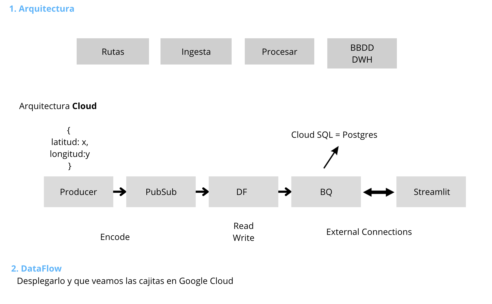

# Arquitectuta Data project 2

En esta imagen podemos ver tanto la arquitetcuta básica como la aplicada en Cloud.

    

## 1. Productor

## 2. PubSub

Queremos combinar la información de dos temas de Pub/Sub en un solo PCollection y realizar asignaciones específicas antes de escribir en BigQuery, lo hacemos usando las transformaciones de Apache Beam.

## 3. DF

## 4. Big Query 

## 5. Streamlit

## 6. Tableau

otra opcion que nos planteamos para visualizar los datos fue Grafana pero debido al coste y nuestra poca expeirencia decidimos usar Tableau.

