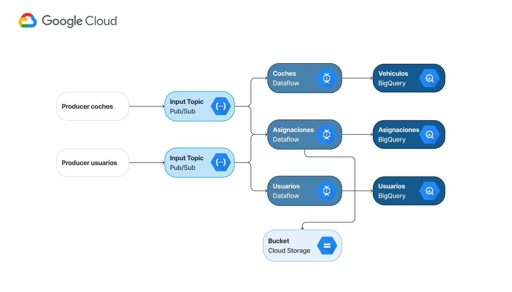

# Data Project 2

- [Data Project 2](#data-project-2)
  - [Introducción](#introducción)
  - [Caso expuesto](#caso-expuesto)
  - [Solución](#solución)
  - [Aquitectura](#aquitectura)
  - [Notas](#notas)

## Introducción

Este es el repositorio relativo al 2 Data Project del Máster de Data Analytics de la promoción 2023-24. El grupo está compuesto por Jackeline Romero, Adriana Campos, Cristian Marty, Jesús Jornet y Mar Pons.

## Caso expuesto

La compañía BlaBlaCar ha tomado la decisión de implementar una plataforma dedicada a los viajes compartidos en la ciudad de Valencia. Este proyecto implica la creación y puesta en marcha de un sistema que permitirá a los usuarios compartir trayectos de manera eficiente y colaborativa en esta área específica. La iniciativa tiene como objetivo facilitar la movilidad de las personas al proporcionar una solución de transporte compartido en Valencia.

## Solución

La herramienta propuesta consta de un sistema de asignacion de viajes que conecta usuarios con coches en tiempo real. Los usuarios determinan una ubicacion de origen y una de destino, mientras que los coches declaran su ruta o trayecto. La herramienta conecta a ambos si existe una coihcidencia entre la ruta declarada de los automovilistas, y el origen y destino introducidos por los usuarios. Todos los viajes son registrados en una base datos, sobre la cual montamos un dashboard que visualiza datos en streaming.

## Aquitectura

## Notas

A primera vista, identificamos tres carpetas. La primera es "cloud", que alberga todo nuestro proyecto. La carpeta "images" contiene las imágenes que necesitamos. Por último, la carpeta "additional" no contiene nada que queramos que se evalúe.
